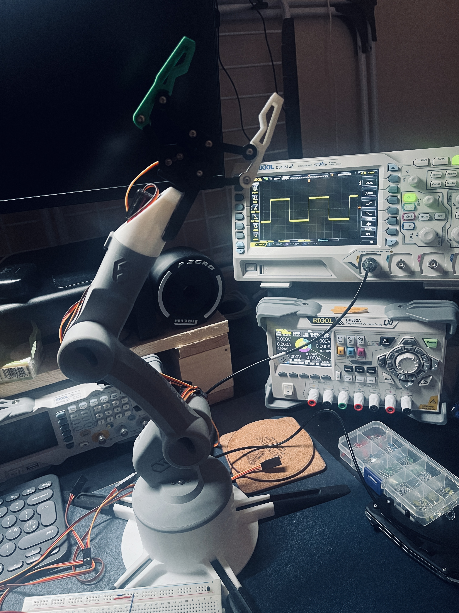
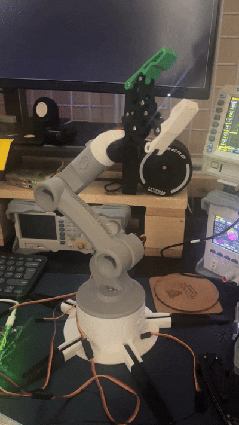

# WiFi Controlled Robotic Arm (Arduino)

## Overview

This project implements a **WiFi-controlled robotic arm controller** using an Arduino board UNO WiFi Rev 4. The system runs a lightweight **HTTP server** that receives coordinate commands over the network and moves servo motors.

The program listens for incoming HTTP requests containing **X, Y, and Z coordinate values**, which are used to control three servo motors:

* **Base rotation**
* **Shoulder joint**
* **Elbow joint**

This code forms part of a **6-DOF robotic arm project**, where additional joints can be added using the same approach.

---

## Features

* WiFi connection using **WiFiS3**
* Lightweight HTTP server running on **port 80**
* Remote control via HTTP requests
* Servo motor calibration at startup
* Serial debugging output
* Simple coordinate parsing from HTTP requests

---

## Hardware Requirements

* Arduino board with WiFi support
  (e.g. Arduino UNO R4 WiFi)
* 3x Servo motors
* External power supply for servos (recommended)
* Robotic arm frame
* Jumper wires

---

## Pin Configuration

| Servo    | Arduino Pin |
| -------- | ----------- |
| Base     | Pin 3       |
| Shoulder | Pin 5       |
| Elbow    | Pin 6       |

---

## Required Libraries

Install the following libraries in the **Arduino IDE**:

* `Servo`
* `WiFiS3`
* `Arduino`

---

## WiFi Setup

Create a file named:

```
arduino_secrets.h
```

Add your WiFi credentials:

```cpp
#define SECRET_SSID "your_wifi_name"
#define SECRET_PASS "your_wifi_password"
```

---

## How It Works

1. The Arduino connects to a WiFi network.
2. A **web server** starts on port `80`.
3. A client sends an HTTP request containing coordinates.
4. The program extracts the values using string parsing.
5. Each coordinate is mapped directly to a **servo angle**.
6. The robotic arm moves accordingly.

Example request:

```
http://<arduino-ip>/?x=90,y=45,z=120
```

Result:

* Base → 90°
* Shoulder → 45°
* Elbow → 120°

---

## Startup Behaviour

When powered on:

1. Serial communication is initialized.
2. The board connects to WiFi.
3. The IP address is printed to the serial monitor.
4. All servos are moved to a **neutral calibration position (90°)**.

---

## Serial Monitor Output

The serial monitor provides debugging information such as:

* WiFi connection status
* Assigned IP address
* Signal strength
* Client connections
* Incoming requests

Example:

```
Serial enabled!
Connecting to: MyWiFi
SSID: MyWiFi
IP Address: 192.168.1.45
signal strength (RSSI):-45 dBm
Client connected!!!
Getting positions
```

---

## API Response

The server responds with:

```
HTTP/1.1 200 OK
Access-Control-Allow-Origin: *
Content-Type: text/plain
Connection: close

Hello
```

This allows the controller to be accessed from **web applications or remote control interfaces**.

---

## Project Structure

```
robotic-arm-controller/
│
├── robotic_arm.ino
├── arduino_secrets.h
└── README.md
```

---

## Future Improvements

Possible extensions for the project:

* Full **6-DOF control**
* Web-based control dashboard
* **Inverse kinematics** calculations
* Motion smoothing
* Speed control
* Integration with **ROS or Python control systems**
* Camera-based object tracking

---






## License

This project is open-source and available under the **MIT License**.
